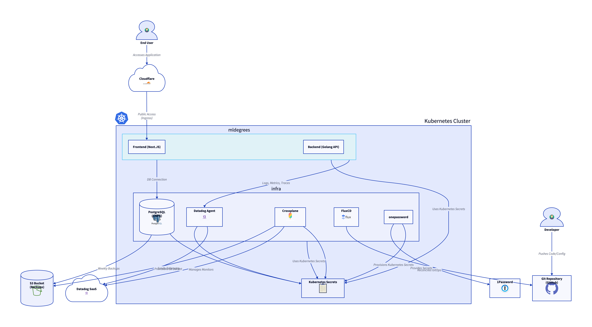

# Machine Learning Degrees Website

A website for [machinelearningdegrees.com](https://machinelearningdegrees.com)
and [mldegrees.com](https://mldegrees.com) that helps people learn about machine
learning degrees and find top programs. Theoretically.

Mostly just a playground for me to have an app to play with to tinker with LLM's
and infrastructure and observability things I care about.

This runs on my homelab cluster in <https://github.com/jfreeland/flux> and uses
helm charts from <https://github.com/jfreeland/helm>.

Most of the code in `backend` and `frontend` has been completely AI generated
with `claude-sonnet-4` and `gemini-2.5-pro`. I've not reviewed most of it. I've
written requirements in `REQUIREMENTS.md` and move completed requirements to
`docs/COMPELTED.md`. I don't know if that's the best practice.

## Architecture



## Project Structure

- `frontend`: Next.js frontend application
- `backend`: Go backend API
- `deploy`: manifests for various deployment related activities

## Getting Started

### Database

```bash
make dev-db-up
```

### Frontend

```bash
make dev-frontend
```

The frontend will be available at
[http://localhost:3000](http://localhost:3000).

### Backend

```bash
make dev-backend
```

The API will be available at
[http://localhost:8080/api](http://localhost:8080/api).

## TODO

- Admins should be able to delete and edit programs directly.
